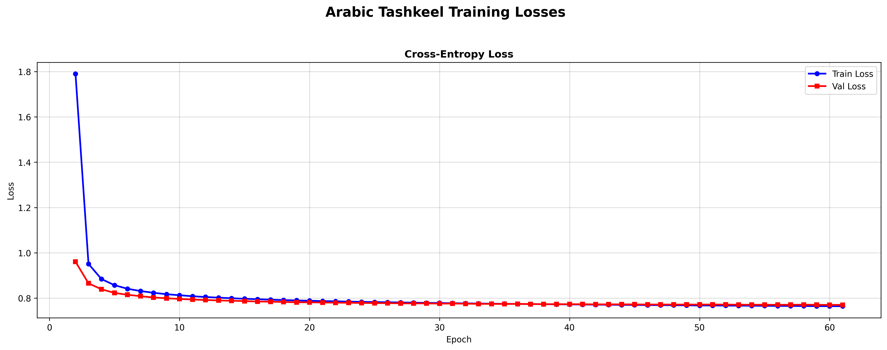
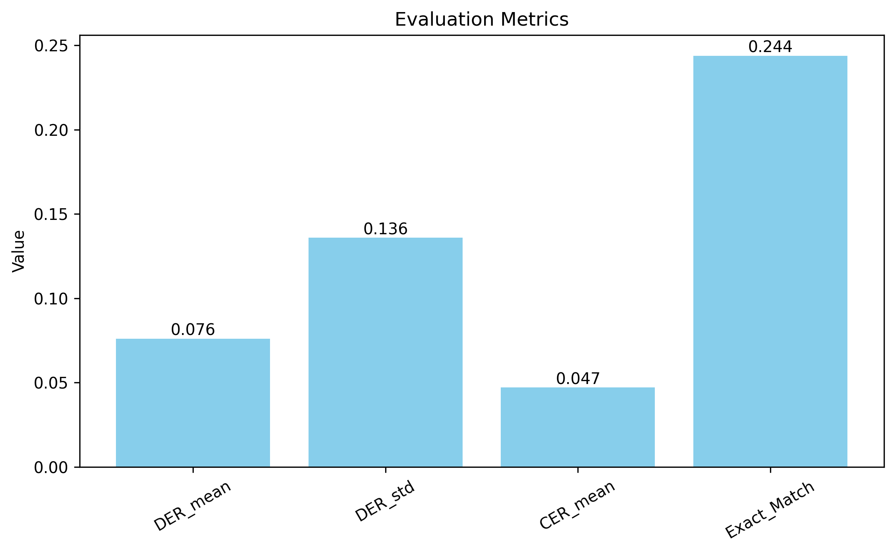

# Arabic Tashkeel Transformer
A character-level Transformer encoder-decoder that adds diacritical marks (تشكيل) to Arabic text, trained from scratch on Arabic EPUB books using PyTorch..

##  Features

- **Character-Level Tokenization** : Exact alignment between input/output; no subword fragmentation of diacritics


- **Transformer Encoder-Decoder**: From-scratch implementation with multi-head attention & positional encoding
	
- **Beam Search Decoding**: Explore multiple hypotheses for higher-quality diacritization
- **Greedy Search**: Fast, lightweight inference option alongside beam 

- **Smart Text Chunking**: Handle arbitrarily long inputs with sentence-aware splitting

- **FastAPI REST API** :Production-ready endpoint with async support & error handling

- **DER Evaluation**:Diacritic Error Rate metric aligned on base characters


## Installation
### Requirements
```bash
pip install -r requirements.txt
```
## Project Structre
```bash
├── app
│   ├── main.py
│   ├── models.py
├── assets
│   ├── config.json
│   └── tokenizer.json
├── checkpoints
│   └── best_model.pt
├── data
│   ├── processed
│   │   └── data.json
├── images
│   └── arc.png
├── LICENSE
├── notebooks
│   └── arabic-tashkeel.ipynb
├── postman_collection
│   └── Arabic-Tashkeel.postman_collection.json
├── README.md
├── requirements.txt
├── scripts
│   └── train.py
├── src
│   ├── data
│   │   ├── dataset.py
│   │   └── tokenizer.py
│   ├── evaluation
│   │   └── metrics.py
│   ├── inference
│   │   ├── beam_search.py
│   │   ├── greedy_decode.py
│   │   ├── predictor.py
│   ├── model
│   │   ├── positional_encoding.py
│   │   └── transformer.py
│   ├── training
│   │   ├── scheduler.py
│   │   └── trainer.py
│   └── utils
│       ├── dataset_creator.py
│       ├── epub_loader.py
│       ├── text_chunker.py
│       └── text_cleaning.py
```

## Model Architecture
```bash
┌─────────────────────────────────────┐
│  INPUT: "كتب الطالب الدرس"          │
└────────────────┬────────────────────┘
                 ▼
┌─────────────────────────────────────┐
│  CHARACTER TOKENIZER                │
│  [ك, ت, ب, _,ا, ل, ط, ...] → IDs    │
└────────────────┬────────────────────┘
                 ▼
┌─────────────────────────────────────┐
│  ENCODER (3 Layers)                 │
│  • Embedding (d_model=256)          │
│  • Positional Encoding (sinusoidal) │
│  • Multi-Head Self-Attention (8h)   │
│  • Feed-Forward Network             │
└────────────────┬────────────────────┘
                 ▼
┌─────────────────────────────────────┐
│  DECODER (3 Layers)                 │
│  • Masked Self-Attention (causal)   │
│  • Cross-Attention ← Encoder Memory │
│  • Feed-Forward Network             │
└────────────────┬────────────────────┘
                 ▼
┌─────────────────────────────────────┐
│  OUTPUT HEAD                        │
│  Linear(d_model → vocab_size)       │
│  Softmax → Next-token distribution  │
└────────────────┬────────────────────┘
                 ▼
┌─────────────────────────────────────┐
│  DECODING                           │
│  • Greedy: argmax at each step      │
│  • Beam Search (k=4): top-k paths   │
└────────────────┬────────────────────┘
                 ▼
┌─────────────────────────────────────┐
│  OUTPUT: "كَتَبَ الطَّالِبُ الدَّرْسَ" │
└─────────────────────────────────────┘

```
## Dataset
- we collect dataset from `أولو العلم `Telegram channel for providing high-quality diacritized Arabic EPUBs

## Training Losses Results


## Evaluation

**Diacritic Error Rate (DER)**
The standard metric for tashkeel tasks:

- Lower is better (0.0 = perfect)
- Computed by aligning prediction/reference on base characters
- Ignores insertion/deletion of base characters (focuses on diacritic accuracy)

**Character Error Rate (CER) using Levenshtein distance.** 
- It measures the minimum number of single-character edits (insertions, deletions, substitutions) required to transform the predicted text into the reference text.
- Lower values indicate better performance (0.0 = perfect match).

**Exact Match**

- measures the proportion of prediction–reference pairs that are completely identical.
- A prediction is counted as correct only if it matches the reference exactly at the character level, including all diacritics.
### Results


! Evaluation was performed on a held-out test set of 5,257 samples.
- CER ≈ 4.7% → low character-level error rate, indicating strong base text preservation
- DER ≈ 7.6% → good diacritic accuracy, consistent with high-quality tashkeel modeling
- DER_std ≈ 0.136 → variability across samples (some sentences are significantly harder)
- Exact Match ≈ 24.4% → strict full-sentence correctness remains challenging, as expected for diacritization tasks
## Postman collection

-  [Download post man collection](/postman_collection/Arabic-Tashkeel.postman_collection.json)

##  Acknowledgments

- أولو العلم Telegram channel for providing high-quality diacritized Arabic EPUBs


*References*

- Vaswani et al. (2017). Attention Is All You Need. arXiv:1706.03762
- Antoun et al. (2020). AraBERT: Transformer-based Model for Arabic Language Understanding. arXiv:2003.00104
- Inoue et al. (2021). Diacritization of Arabic Text Using Deep Learning. ACL 2021
---

 Made with ❤️ for the Arabic NLP community
